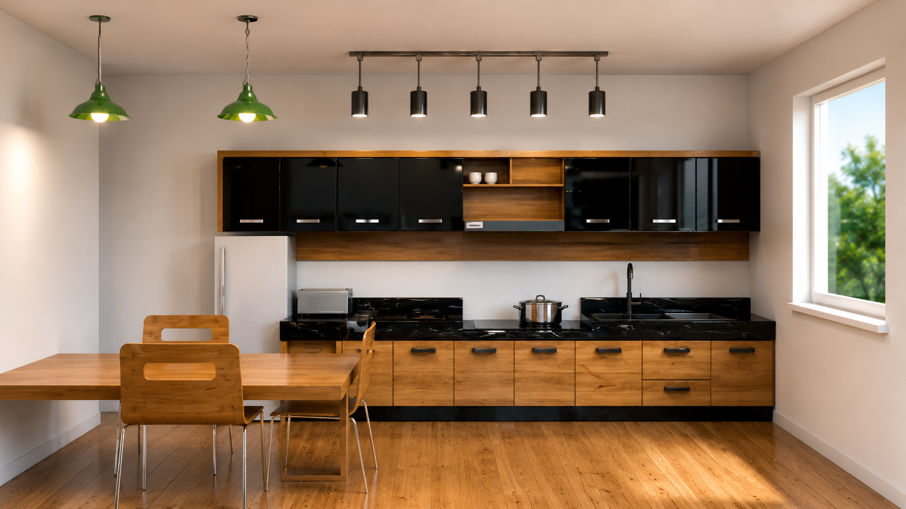
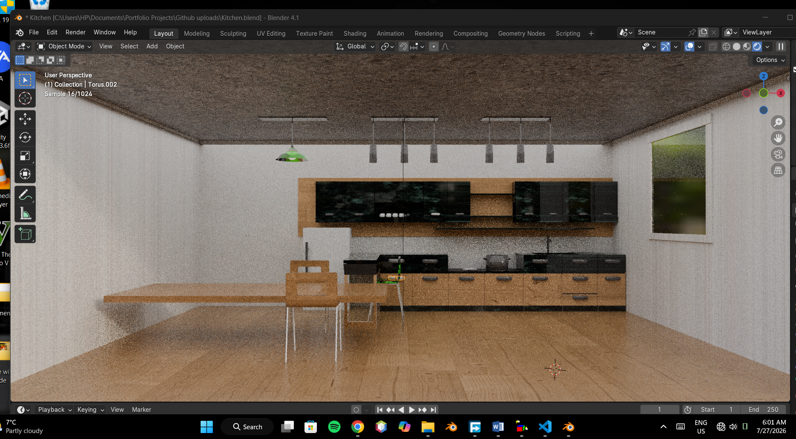
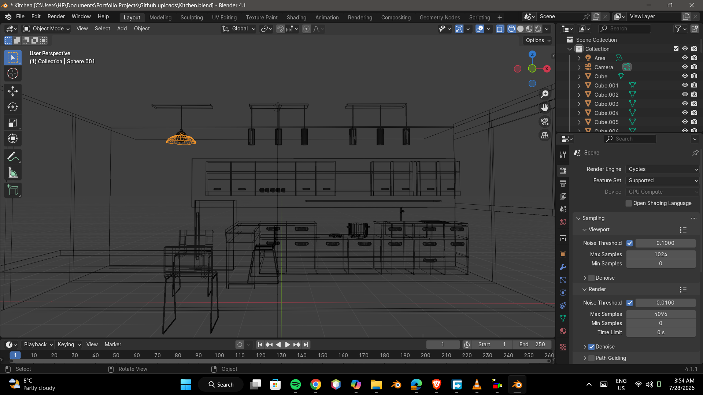
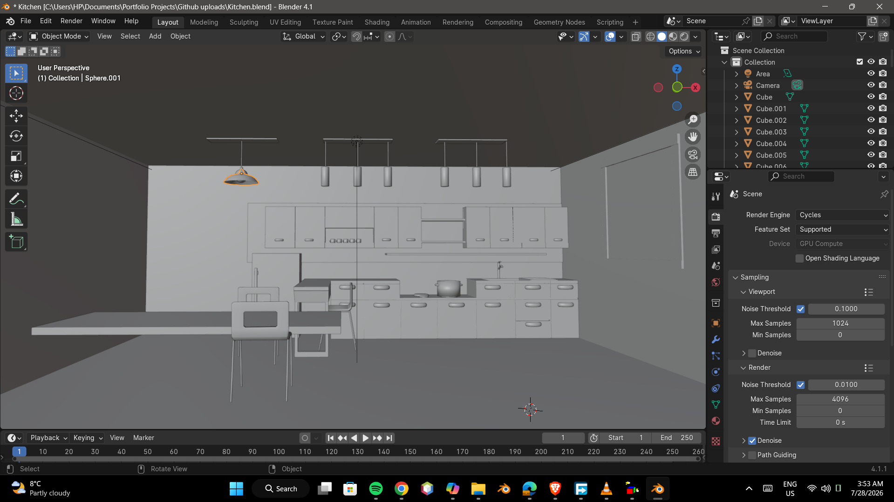

# Minimalist Living Room
 
A compact living room scene built to study warm ambient lighting, upholstery texturing, and material layering across wood, glass, and fabric.
 

 
## Process
 

 
## Details
 
- **Software:** Blender
- **Focus:** Lighting, texturing
- **Description:** Small living room scene modelled to practice material layering — ribbed upholstery, glass coffee table, and timber flooring — lit with warm ambient and pendant lighting.
## Files
 
- `living-room.blend` — full Blender scene file
- `renders/` — final and in-progress render images
## Contact
 
Sabelo Maseko — [add your email or portfolio link here]
